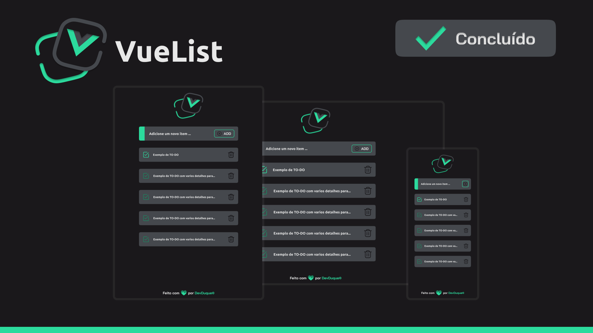

<h1 align="center"> Front-End </h1>

<h1 align="center">


</h1>

Este Front-End foi desenvolvido em Vue.JS. Para a execução é necessário um gerenciador de pacote (npm ou yarn).

<p> Este Front-End foi desenvolvido utilizando <a href="https://br.vuejs.org/">Vue.JS</a></p>

<p> É necessário um gerenciador de pacotes, seja o <a href="https://yarnpkg.com/">Yarn</a> ou <a href="https://www.npmjs.com/">NPM</a> </p>

<p> Esta documentação fornece uma visão geral do Front-End, incluindo estilização, logos e cores.</p>

<h2> Requisitos </h2>

- <p><a href="https://br.vuejs.org/">Vue JS:</a> 3.2.0</p>
- <p><a href="https://cli.vuejs.org/">Vue-CLI:</a> 5.0.8</p>
- <p><a href="https://www.npmjs.com/">NPM mais recente</a> ou <a href="https://yarnpkg.com/">Yarn mais recente</a></p>

<p style="font-style: italic; text-align: center; "> Os requisitos considerados, são os utilizados para o desenvolvimento dessa aplicação </p>

<h2> Instalação de dependências & Execução do projeto</h2>

- <p> Depois de instalado os requisitos, execute os seguintes códigos no terminal: </p>

```javascript
    // Para instalar as depedências
    npm install

    // Executar o projeto Front-End
    npm run serve
```

<h2> Estilização </h2>

<h1 align="center">



</h1>

<h2 align="center"><span> Cores </span></h2>

<p> Cor de fundo: <span style="background-color: #1A181B; color: #FFF"> #1A181B </span></p>
<p> Cor de fundo dos elementos: <span style="background-color: #45484D; color: #FFF"> #1A181B </span></p>
<p> Cor primária (Botões, Borda, Logo): <span style="background-color: #2CDA9D; color: #1A181B"> #1A181B </span></p>

<h3 align="center">
      Criado com
      
      por <a href="https://github.com/DevDuque">DevDuque</a>
    </h3>
