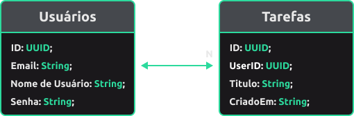

<h1> Back-End (PHP & MySQL) </h1>

Este Back-End foi desenvolvido utilizando PHP e MySQL para facilitar a criação e manipulação de banco de dados. É necessário um servidor PHP para executar este projeto. Esta documentação fornece uma visão geral do projeto, incluindo configuração, estrutura do banco de dados e exemplos de uso.

<h2> Requisitos </h2>

- <p><a href="https://www.php.net/manual/pt_BR/features.commandline.webserver.php">Servidor PHP:</a> 8.2.18</p>
- <p><a href="https://dev.mysql.com/downloads/mysql/">Servidor MySQL:</a> 8.3.0</p>

<p> Ambos executados pelo <a href="https://sourceforge.net/projects/wampserver/">WampServer</a></p>

<p style="font-style: italic; text-align: center; "> Os requisitos considerados, são os utilizados para o desenvolvimento dessa aplicação </p>

<h2> Configuração do Banco de Dados </h2>

<h4> 1. Instalação do servidor: </h4>

- <p> Instale o <a href="https://sourceforge.net/projects/wampserver/">WampServer</a>  ou outro servidor de sua escolha; </p>
- <p> Certifique-se de que o <a href="https://www.php.net/">PHP</a> e o <a href="https://www.mysql.com/">MySQL</a> estão sendo executado corretamente. </p>

<h4> 2. Configuração do banco de dados: </h4>

- <p> Acesse o <a href="https://www.phpmyadmin.net/">phpMyAdmin</a> (ou qualquer ferramenta MySQL de sua escolha);</p>

- <p> Crie um banco de dados com o nome que preferir.</p>

<h4> 3. Importe o esquema do banco de dados: </h4>

- <p> Execute o script SQL fornecido para criar as tabelas necessárias. O script está localizado em <a href="./config/tables.php">./config/tables.php</a></p>

<h2> Configuração do PHP  </h2>

<h4> 1. Arquivo de Configuração: </h4>

- <p> Crie um arquivo chamado <span> database.php </span> dentro de  <span>./config/tables.php</span>, e adicione os seguintes códigos: </p>

```php
    <?php
    $servername = "nome_do_servidor";
    $username = "nome_de_usuario";
    $password = "senha";
    $dbname = "nome_do_banco";

    $conn = new mysqli($servername, $username, $password, $dbname);

    if ($conn->connect_error) {
        die("ERROR: Conexão falhou: " . $conn->connect_error);
    }
```

<h2> Estrutura do Banco de Dados </h2>

<h2 align="center"> </h2>

<p>Com isso, chegamos na seguinte lógica: <br/> Um Usuário, contém N Tarefas; N Tarefas aponta para Um Usuário</p>

<h2> EndPoints da API  </h2>

<h2 align="center"><a href="./api/Task/getTasksByUserID.php">Obter Tarefas do Usuário</a></h2>
<p>Método: <span>GET</span></p>
<p>URL: <span>http://nome_do_servidor/database/api/Task/getTasksByUserID.php</span></p>
<p>Parâmetros de Query: <span>userID</span> (ID do usuário para filtrar as tarefas).</p>

<span style="align-self: center"> Exemplo de resposta bem sucedida:</span>

```json
{
  "success": true,
  "tasks": [
    {
      "taskID": "91a3cc1c-9185-4153-8742-064504b162aa",
      "userID": "e81c571a-99f9-420d-a2cd-4fccaf1aeaa6",
      "title": "Exemplo de Tarefa",
      "checked": false,
      "createdAt": "03/12/2024 - 20:20"
    }
    // Mais tarefas
  ]
}
```

<h2 align="center"><a href="./api/Task/createTask.php">Criar Nova Tarefa</a> </h2>
<p>Método: <span>POST</span></p>
<p>URL: <span>http://nome_do_servidor/database/api/Task/createTask.php</span></p>

<span style="align-self: center"> Corpo da Requisição:</span>

```json
{
  // Dados enviados pelo usuário
  "title": "Exemplo de tarefa",
  "userID": "e81c571a-99f9-420d-a2cd-4fccaf1aeaa6",

  // Dados que são automaticamente preenchidos,
  "taskID": "UUID Gerado pelo Back-End",
  "checked": false, // False como padrão
  "createdAt": "Data de criação com Horas:Minutos"
}
```

<span style="align-self: center"> Exemplo de resposta bem sucedida:</span>

```json
{
  "success": true,
  "taskID": "08f5ce32-adf8-443c-a347-80f51cf279c8",
  "userID": "e81c571a-99f9-420d-a2cd-4fccaf1aeaa6",
  "title": "Exemplo de Tarefa",
  "checked": false,
  "createdAt": "03/12/2024 - 20:20"
}
```

<h2 align="center"><a href="./api/Task/updateTaskByID.php">Atualizar Tarefa (Check/Uncheck) ou (Title)</a> </h2>
<p>Método: <span>PUT</span></p>
<p>URL: <span>http://nome_do_servidor/database/api/Task/updateTaskByID.php</span></p>
<p>Parâmetros de Query: <span>taskID</span> (ID da tarefa a ser atualizada).</p>

<span style="align-self: center"> Corpo da Requisição:</span>

```json
{
  // Dados enviados pelo usuário
  "taskID": 1,
  "title": "Título Atualizado",
  "checked": true
}
```

<span style="align-self: center"> Exemplo de resposta bem sucedida:</span>

```json
{
  "success": true
}
```

<h2 align="center"><a href="./api/Task/deleteTaskByID.php">Deletar uma tarefa</a></h2>
<p>Método: <span>DELETE</span></p>
<p>URL: <span>http://nome_do_servidor/database/api/Task/deleteTaskByID.php</span></p>

<span style="align-self: center"> Corpo da Requisição:</span>

```json
{
  // Dados enviados pelo usuário
  "taskID": "08f5ce32-adf8-443c-a347-80f51cf279c8"
}
```

<span style="align-self: center"> Exemplo de resposta bem sucedida:</span>

```json
{
  "success": true
}
```

<h3 align="center">
      Criado com
      
      por <a href="https://github.com/DevDuque">DevDuque</a>
    </h3>

<style>
    *, a {
        color: #2CDA9D;
        font-weight: bold;
    }
    
    a:hover {
        color: #1f996e;
        transition: color 350ms cubic-bezier(0.4, 0, 0.2, 1);
        text-decoration:none;
    }

    p, h2, h4, h3 {
        color: #EEEDF0;
        font-weight: bold;
    }

    h3 {
        font-size: 2.5rem;
    }

    img {
        vertical-align: middle;
    }

</style>
